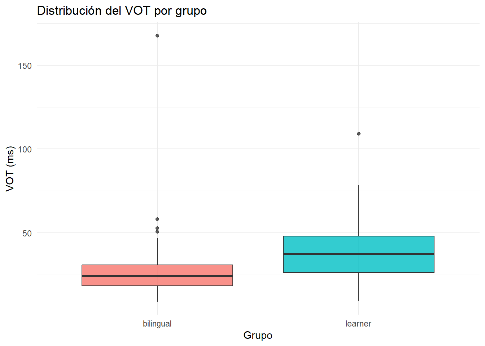
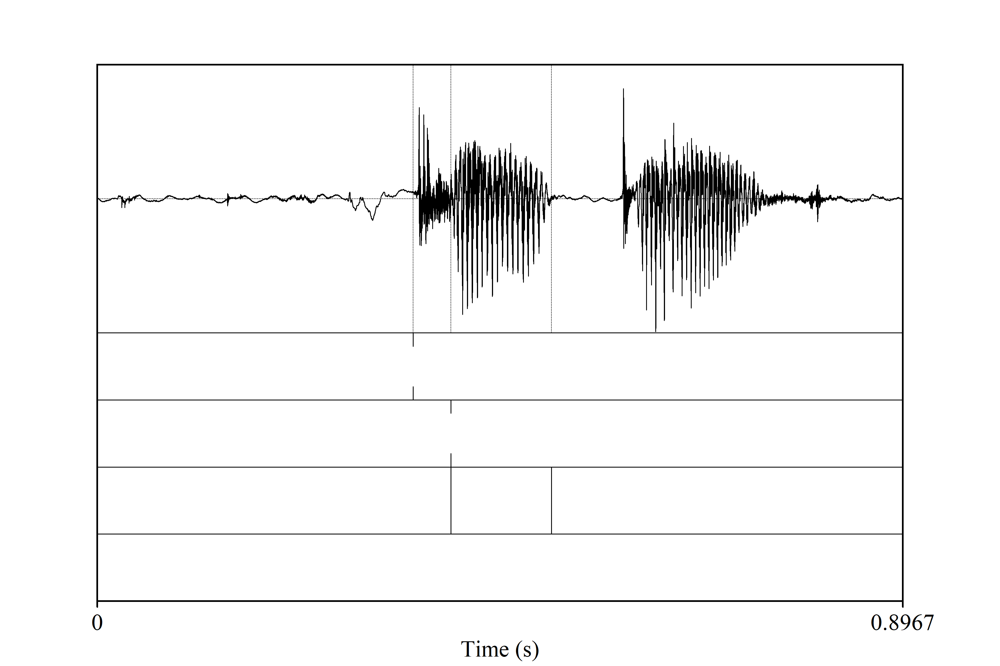

Programming assignment 4
================

**Author**: hector wiscow  
**Date**: Last update: 2025-11-25 18:16:00.221657 execute: warning:
false message: false

# Overview

<!-- 
  Learners of Spanish will show a longer VOT than Spanish-English  Bilinguals. 
-->

# Prep

## Libraries

``` r
# library
library(tidyverse)
```

    ## ── Attaching core tidyverse packages ──────────────────────── tidyverse 2.0.0 ──
    ## ✔ dplyr     1.1.4     ✔ readr     2.1.5
    ## ✔ forcats   1.0.1     ✔ stringr   1.5.1
    ## ✔ ggplot2   4.0.0     ✔ tibble    3.3.0
    ## ✔ lubridate 1.9.4     ✔ tidyr     1.3.1
    ## ✔ purrr     1.1.0     
    ## ── Conflicts ────────────────────────────────────────── tidyverse_conflicts() ──
    ## ✖ dplyr::filter() masks stats::filter()
    ## ✖ dplyr::lag()    masks stats::lag()
    ## ℹ Use the conflicted package (<http://conflicted.r-lib.org/>) to force all conflicts to become errors

``` r
library(readr)
library(knitr)
```

## Load data

``` r
#|label: load-data
#| message: false
#| warning: false

all_data <- fs::dir_ls("../data", glob = "*.csv") |>
  map_dfr(~ read_csv(.x, show_col_types = FALSE) |>
            mutate(
              group = ifelse(str_detect(.x, "/bi"), "bilingual", "learner")
            )
  )
```

    ## Warning: One or more parsing issues, call `problems()` on your data frame for details,
    ## e.g.:
    ##   dat <- vroom(...)
    ##   problems(dat)
    ## One or more parsing issues, call `problems()` on your data frame for details,
    ## e.g.:
    ##   dat <- vroom(...)
    ##   problems(dat)
    ## One or more parsing issues, call `problems()` on your data frame for details,
    ## e.g.:
    ##   dat <- vroom(...)
    ##   problems(dat)
    ## One or more parsing issues, call `problems()` on your data frame for details,
    ## e.g.:
    ##   dat <- vroom(...)
    ##   problems(dat)
    ## One or more parsing issues, call `problems()` on your data frame for details,
    ## e.g.:
    ##   dat <- vroom(...)
    ##   problems(dat)
    ## One or more parsing issues, call `problems()` on your data frame for details,
    ## e.g.:
    ##   dat <- vroom(...)
    ##   problems(dat)

``` r
glimpse(all_data)
```

    ## Rows: 270
    ## Columns: 2
    ## $ `fileID,f1,f2,vot,notes` <chr> "bi01_kaka,650.90,1637.02,24.81,", "bi01_kaka…
    ## $ group                    <chr> "bilingual", "bilingual", "bilingual", "bilin…

## Tidy data

``` r
all_data <- all_data %>%
  
  separate(
    `fileID,f1,f2,vot,notes`,
    into = c("fileID", "f1", "f2", "vot", "notes"),
    sep = ",",
    remove = TRUE
  ) %>%
 
  mutate(
    f1  = as.numeric(f1),
    f2  = as.numeric(f2),
    vot = as.numeric(vot)
  )

glimpse(all_data)
```

    ## Rows: 270
    ## Columns: 6
    ## $ fileID <chr> "bi01_kaka", "bi01_kaka1", "bi01_kaka2", "bi01_keke", "bi01_kek…
    ## $ f1     <dbl> 650.90, 714.32, 709.19, 495.24, 893.01, 579.31, 823.90, 348.26,…
    ## $ f2     <dbl> 1637.02, 1567.58, 1560.03, 2168.42, 2152.98, 2339.40, 2711.97, …
    ## $ vot    <dbl> 24.81, 25.49, 28.29, 31.55, 32.39, 32.87, 18.54, 52.80, 50.48, …
    ## $ notes  <chr> "", "", "", "", "", "", "", "", "", "", "", "", "", "", "error"…
    ## $ group  <chr> "bilingual", "bilingual", "bilingual", "bilingual", "bilingual"…

# Analysis

## Descriptives

``` r
vot_summary <- all_data %>%
  group_by(group) %>%
  summarise(
    mean_vot = mean(vot, na.rm = TRUE),
    sd_vot   = sd(vot, na.rm = TRUE),
    n        = n()
  )

knitr::kable(vot_summary, digits = 2)
```

| group     | mean_vot | sd_vot |   n |
|:----------|---------:|-------:|----:|
| bilingual |    26.33 |  15.21 | 135 |
| learner   |    39.29 |  16.23 | 135 |

## Visualization

``` r
ggplot(all_data, aes(x = group, y = vot, fill = group)) +
  geom_boxplot(alpha = 0.8) +
  labs(
    title = "Distribución del VOT por grupo",
    x = "Grupo",
    y = "VOT (ms)"
  ) +
  theme_minimal() +
  theme(legend.position = "none")
```



<!-- 
Also include a professional looking figure illustrating an example of the acoustics 
of the production data, i.e., a plot generated in praat.
You decide what is relevant (something related to your hypothesis). 
Think about where this file should be located in your project. 
What location makes most sense in terms of organization? 
How will you access the file (path) from this .Rmd file?
If you need help consider the following sources: 
  - Search 'Rmarkdown image' on google, stackoverflow, etc.
  - Search the 'knitr' package help files in RStudio
  - Search the internet for HTML code (not recommended, but it works)
  - Check the code from my class presentations (may or may not be helpful)
-->

## Example acoustic figure

Below is an example of the acoustic properties of one token, including
waveform, spectrogram, formants, and TextGrid annotation.



## Hypothesis test

``` r
t_test_result <- t.test(vot ~ group, data = all_data)

t_test_result
```

    ## 
    ##  Welch Two Sample t-test
    ## 
    ## data:  vot by group
    ## t = -6.7663, df = 266.89, p-value = 8.341e-11
    ## alternative hypothesis: true difference in means between group bilingual and group learner is not equal to 0
    ## 95 percent confidence interval:
    ##  -16.723040  -9.184368
    ## sample estimates:
    ## mean in group bilingual   mean in group learner 
    ##                26.33481                39.28852

# Conclusion

<!-- 
Revisit your hypotheses (refer to plots, figures, tables, statistical tests, 
etc.)
&#10;Reflect on the entire process. 
What did you enjoy? What did you hate? What did you learn? 
What would you do differently?
-->

------------------------------------------------------------------------

The hypothesis is a very easy one, and maybe even obvious. However, it
clearly reflects the measurable evidence observed in the audio files.
When I was segmenting the audios, I noticed a clear distinction between
bilinguals and L2 learners in their productions of **p, t, k**. The VOT
was much longer in the L2 learners, and this was observable through both
the spectrogram and the oscillogram in Praat. Another observation,
although not related to my hypothesis, was the duration of the vowels.
In most cases, there is a noticeable difference depending on the vowel
and the consonant that precedes it. Sometimes, it was difficult to mark
the beginning of voicing.

In this assignment, there are plots, tables, and a Praat image that
helps illustrate the hypothesis because it shows the VOT in one of the
audios analyzed in Praat. It is hard to believe, but I enjoyed doing
this assignment much more than previous ones, even though it was
considerably longer. I think part of that is because I have started to
better understand how the programming assignments work. I used many
resources to help me understand, including Google searches, YouTube
videos from the professor, and ChatGPT, which helped me understand some
of the terminology I needed to use, what the functions do, what type of
information they collect, and how they transform the data I was working
with.

It took me a lot of time if I count the hours spent segmenting the
audios and the time needed in RStudio. What I enjoyed the most from this
assignment, and others, was being able to work with my classmates—some
of them have been very helpful. I also enjoyed using Praat during the
two final assignments. What I did not enjoy was struggling to understand
the programming language easily. I associate it with learning math: for
some people it is extremely easy, yet for others it takes much more time
and exposure. I feel like this is the case for me.

I would definitely seek extra help if I could. For me it is important to
understand what I am doing because it gives me motivation. I did not
feel that way at the beginning because I wasn’t able to fully understand
what I had to do and why. This started to change slightly towards the
final stage of the class, which made me feel more comfortable and
motivated. It is a long process; I am not at a point where I can say I
fully understand everything, but I definitely feel more motivated with
this type of assignment than before. I now have an idea of its
importance, so I guess I will do better in the future with similar
courses. Now that I am starting to understand more, the course is almost
over. It’s ironic.

Finally, I enjoyed this class. Thank you!
